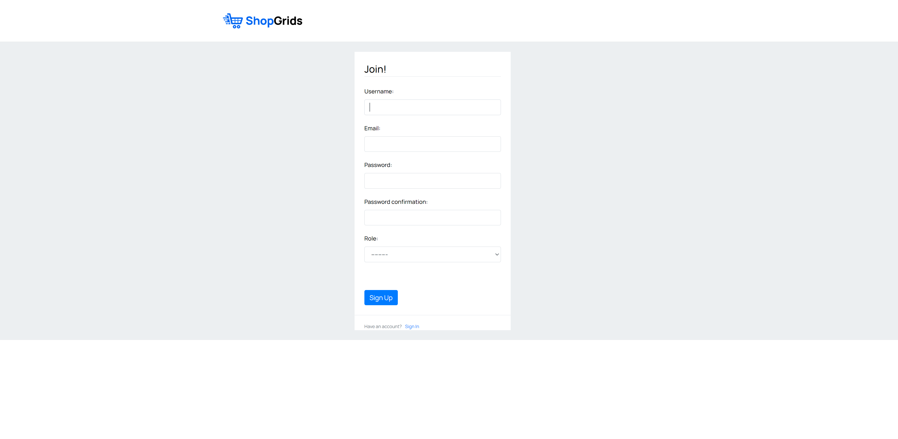
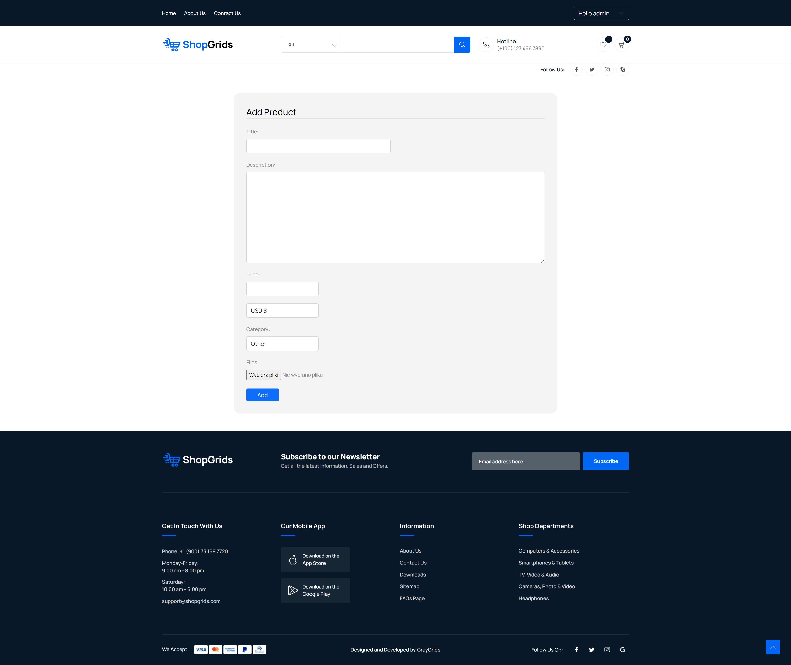

# Webshop
> This is an online store website project where users can sell and buy products. It was created to use the knowledge acquired during the Dev-Mentoring course.

## Table of contents
* [General information](#general-information)
* [Used technologies](#used-technologies)
* [Features](#features)
* [Screenshots](#screenshots)
* [Project status](#project-status)
* [Room for improvement](#room-for-improvement)

## General information
The goal of the project is to improve Django programming skills.

Webshop is a site when users can:
- sell products
- buy products
- ratings products
  
This project was part of the Python Dev-Mentoring programming course.

## Used technologies
- awsebcli – version 3.20.10
- botocore – version 1.31.85
- celery – version 5.3.6
- Django – version 4.0.10
- docker – version 6.1.3
- elasticsearch – version 8.10.1
- elsticsearch-dsl – version 8.9.0
- factory-boy – version 3.3.0
- Faker – version 22.2.0
- pre-commit – version 3.5.0
- python - version 3.10.4
- redis – version 5.0.3
- redis-cli – version 1.0.1
- stripe – version 6.7.0

## Features
- User registration and login
- You can add/edit/delete products, if you have seller role
- Product ratings
- Profile editing:
	- Changing your profile picture, user name and e-mail
	- Adding/editing the shipping address
- Adding and removing products from your wish list
- Adding and removing products from your cart
- Changing the quantity of a given product in your cart
- Preview of your orders
- Preview of your clients orders, if you have seller role

## Screenshots

## Project status
Project is in progress

## Room for Improvement
