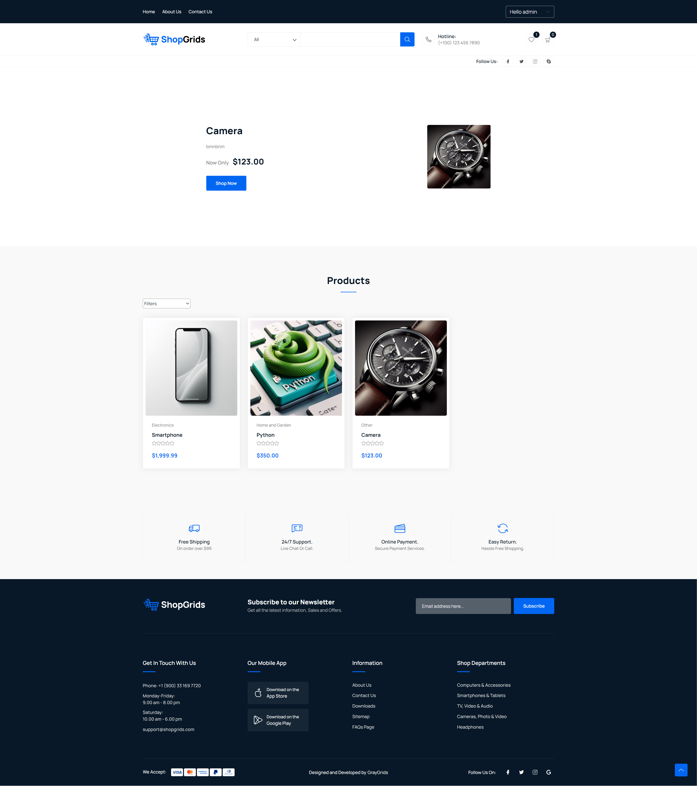
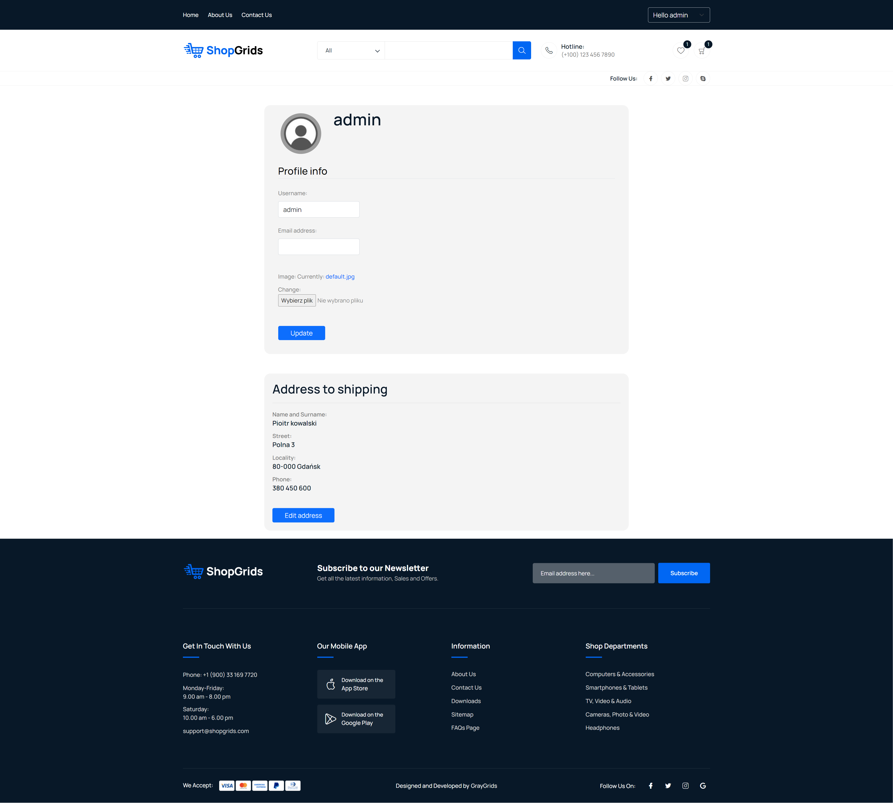

# Webshop
> This is an online store website project where users can sell and buy products. It was created to use the knowledge acquired during the Dev-Mentoring course.

## Table of contents
* [General information](#general-information)
* [Used technologies](#used-technologies)
* [Features](#features)
* [Screenshots](#screenshots)
* [Setup](#setup)
* [Project status](#project-status)


## General information
The goal of the project is to improve Django programming skills.

Webshop is a site when users can:
- sell products
- buy products
- ratings products
  
This project was part of the Python Dev-Mentoring programming course.

## Used technologies
- bootstrap - version 5
- celery – version 5.3.6
- Django – version 4.0.10
- docker – version 6.1.3
- elasticsearch – version 8.10.1
- elsticsearch-dsl – version 8.9.0
- factory-boy – version 3.3.0
- pre-commit – version 3.5.0
- python - version 3.10.4
- redis – version 5.0.3
- redis-cli – version 1.0.1
- stripe – version 6.7.0


## Features
- User registration and login
- You can add/edit/delete products, if you have seller role
- Product ratings
- Profile editing:
	- Changing your profile picture, user name and e-mail
	- Adding/editing the shipping address
- Adding and removing products from your wish list
- Adding and removing products from your cart
- Changing the quantity of a given product in your cart
- Preview of your orders
- Preview of your clients orders, if you have seller role


## Screenshots

<details> 
<summary></summary>
	






</details>


## Setup
The first thing to do is to clone the repository:

```sh
$ git clone https://github.com/MG814/Webshop.git
```
```sh
$ cd Webshop
```

Create a virtual Python environment by typing the following command in the terminal:

`python -m venv /path/to/new/virtual/environment`

Then activate the created environment by typing the appropriate command:
on Windows:

`C:\> <venv>\Scripts\activate.bat`

on POSIX:

`$ source <venv>/bin/activate`
 
Then install the dependencies:

```sh
(venv)$ pip -r install requirements.txt
```

Now create new docker container:

```sh
(venv)$ cd src
```
```sh
(venv)$ docker-compouse up
```

Run stripe services:

```sh
(venv)$ .\stripe listen --forward-to localhost:8000/webhook
```

To run the program, type:

```sh
(venv)$ python manage.py runserver
```


## Project status
Project is complete
